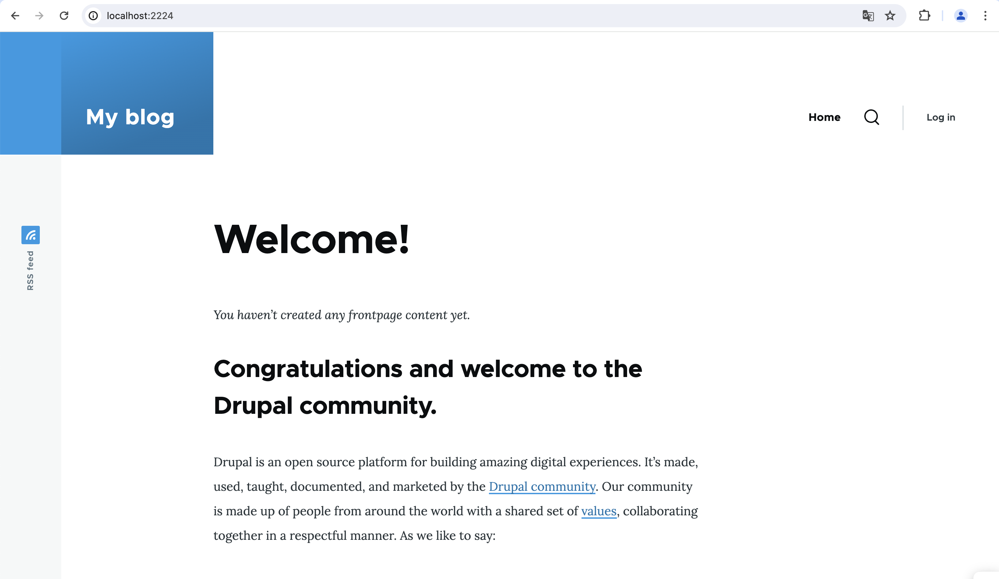

# Task 001 - Configure Auto Scaling


* Follow the instructions in the tutorial [Getting started with Amazon EC2 Auto Scaling](https://docs.aws.amazon.com/autoscaling/ec2/userguide/GettingStartedTutorial.html) to create a launch template.

* [CLI Documentation](https://docs.aws.amazon.com/cli/latest/reference/autoscaling/)

## Pre-requisites

* Networks (RTE-TABLE/SECURITY GROUP) set as at the end of the Labo2.
* 1 AMI of your Drupal instance
* 0 existing ec2 (even is in a stopped state)
* 1 RDS Database instance - started
* 1 Elastic Load Balancer - started

## Create a new launch template. 
[Source](https://docs.aws.amazon.com/AWSEC2/latest/UserGuide/create-launch-template.html)

|Key|Value|
|:--|:--|
|Name|LT-DEVOPSTEAM[XX]|
|Version|v1.0.0|
|Tag|Name->same as template's name|
|AMI|Your Drupal AMI|
|Instance type|t3.micro (as usual)|
|Subnet|Your subnet A|
|Security groups|Your Drupal Security Group|
|IP Address assignation|Do not assign|
|Storage|Only 10 Go Storage (based on your AMI)|
|Advanced Details/EC2 Detailed Cloud Watch|enable|
|Purchase option/Request Spot instance|disable|

```
[INPUT]
//cli command is optionnal. Important is the screen shot to delivery in next step (testing and validation)
Done with the AWS Web Console.

[OUTPUT]
```

## Create an autoscaling group
[Source](https://docs.aws.amazon.com/autoscaling/ec2/userguide/create-asg-launch-template.html)

* Choose launch template or configuration

|Specifications|Key|Value|
|:--|:--|:--|
|Launch Configuration|Name|ASGRP_DEVOPSTEAM[XX]|
||Launch configuration|Your launch configuration|
|Instance launch option|VPC|Refer to infra schema|
||AZ and subnet|AZs and subnets a + b|
|Advanced options|Attach to an existing LB|Your ELB|
||Target group|Your target group|
|Health check|Load balancing health check|Turn on|
||health check grace period|10 seconds|
|Additional settings|Group metrics collection within Cloud Watch|Enable|
||Health check grace period|10 seconds|
|Group size and scaling option|Desired capacity|1|
||Min desired capacity|1|
||Max desired capacity|4|
||Policies|Target tracking scaling policy|
||Target tracking scaling policy Name|TTP_DEVOPSTEAM[XX]|
||Metric type|Average CPU utilization|
||Target value|50|
||Instance warmup|30 seconds|
||Instance maintenance policy|None|
||Instance scale-in protection|None|
||Notification|None|
|Add tag to instance|Name|AUTO_EC2_PRIVATE_DRUPAL_DEVOPSTEAM[XX]|

```
[INPUT]
//cli command is optionnal. Important is the screen shot to delivery in next step (testing and validation)
Done with the AWS Web Console.

[OUTPUT]
```

* Result expected

The first instance is launched automatically.

Test ssh and web access.

```
[INPUT]
$ ssh devopsteam16@15.188.43.46 -i CLD_KEY_DMZ_DEVOPSTEAM16.pem -L 2224:internal-ELB-DEVOPSTEAM16-1841517474.eu-west-3.elb.amazonaws.com:8080 -L 2226:10.0.16.11:22

$ ssh bitnami@localhost -p 2226 -i CLD_KEY_DRUPAL_DEVOPSTEAM16.pem

[OUTPUT]
Linux ip-10-0-16-11 5.10.0-28-cloud-amd64 #1 SMP Debian 5.10.209-2 (2024-01-31) x86_64

The programs included with the Debian GNU/Linux system are free software;
the exact distribution terms for each program are described in the
individual files in /usr/share/doc/*/copyright.

Debian GNU/Linux comes with ABSOLUTELY NO WARRANTY, to the extent
permitted by applicable law.
       ___ _ _                   _
      | _ |_) |_ _ _  __ _ _ __ (_)
      | _ \ |  _| ' \/ _` | '  \| |
      |___/_|\__|_|_|\__,_|_|_|_|_|
  
  *** Welcome to the Bitnami package for Drupal 10.2.3-1        ***
  *** Documentation:  https://docs.bitnami.com/aws/apps/drupal/ ***
  ***                 https://docs.bitnami.com/aws/             ***
  *** Bitnami Forums: https://github.com/bitnami/vms/           ***
Last login: Thu Mar  7 15:59:00 2024 from 10.0.0.5
bitnami@ip-10-0-16-11:~$ 
```

```
//screen shot, web access (login)
```


